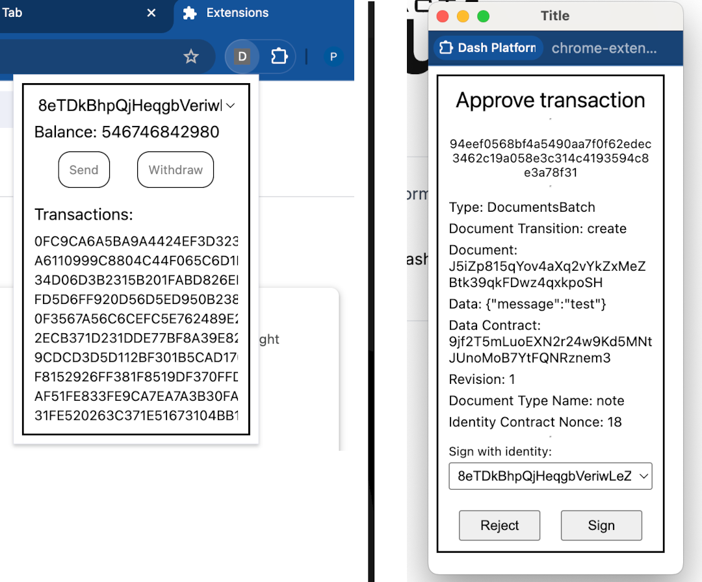

# Dash Platform Extension


###### A browser extension that let users easily interact with Dash Platform DApps.

___

##### This package in very early stage of development, and only testnet network supported at the moment.



## General

Dash Platform extension is browser extension that shares an instance of [Dash Platform SDK](https://github.com/pshenmic/dash-platform-sdk) to the webpages when this extension is installed in your browser.

It works by providing a Javascript interface in the window object that let developers request transaction signing without asking them from a private key or seed phrase on the website itself.

Currently, it works by storing a private key from the Identity in the extension's storage, but in the next versions it is going to be possible to hand off storage of private keys to the Mobile device for enhanced security or pay with QR code.

It is not necessary to import all of Identity's keys to start interacting with applications, usually you only need AUTHENTICATION public key to start submitting documents, while other of your keys can be stay safe.

Furthermore, if your key is leaked, it is always possible to revoke leaked key and recreate new one for your identity.


## Current features

* Import identity by private key (only one currently supported)
* Show basic info (balance, transactions)
* Javascript API for transaction signing window dialogue

## Install

Only manual installation is currently supported

Head over to the Releases section, download a build archive, unpack it, and go to your Chrome's extensions menu and click "Load unpacked" button.

## Developer API

When user installs the extension and visit the DApp website, it injects a Dash Platform SDK instance in the `window` object, that let developers start working with it straight right away.

For instance:
```js
export const handleSendMessageButton = async () => {
  const {dashPlatformSDK} = window

  // owner
  const identity = '8eTDkBhpQjHeqgbVeriwLeZr1tCa6yBGw76SckvD1cwc'
  const dataContract = '9jf2T5mLuoEXN2r24w9Kd5MNtJUnoMoB7YtFQNRznem3'
  const documentTypeName = 'note'
  const data = {
    "message": "test",
  }

  // const privateKey = dashPlatformSDK.wasm.PrivateKeyWASM.fromHex('E150920AA4FD530B1AFDCA7AC939EB14D63B6D065CC88BBE1A1DF66ED593FE31')
  const privateKey = dashPlatformSDK.wasm.PrivateKeyWASM.fromWIF('cV8gdL3T1syAMbg71EY7LuJAvdyVajE2XAzkdzHTw5AHmADt1pr6')
  const identityContractNonce = dashPlatformSDK.identities.getIdentityContractNonce(identity, dataContract)
  const document = await dashPlatformSDK.documents.create(dataContract, 'note', data, identityContractNonce + 1n, identity)
  const createTransition = new dashPlatformSDK.wasm.DocumentCreateTransitionWASM(document, identityContractNonce + 1n, documentTypeName)
  const documentsBatch = new dashPlatformSDK.wasm.DocumentsBatchWASM([createTransition.toDocumentTransition()], identity, 0, 0, null)
  const stateTransition = documentsBatch.toStateTransition()

  await dashPlatformSDK.signer.signStateTransition(stateTransition)
}
```

## Next features

Currently, the application is very raw and fragile and requires a lot of checks and validations for a stable work.

* Multiple identities in storage
* Import Identities from seed phrase
* Register Identity (with different payment methods)
* Send and Withdraw credits
